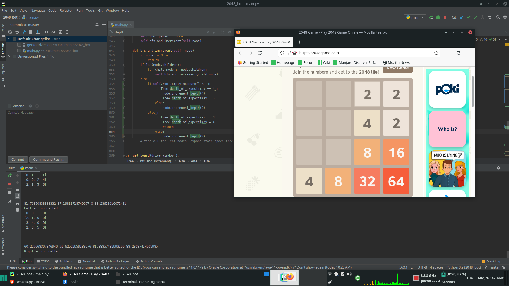

# **2048 Bot**

This is one of most easiest, well documented and researched problem in automating game play of zero sum game. 
I made this project to understand the basics of expectimax and min-man algorithm, as well as impliment state space Tree.
The heurisitc's user a monotonicity , emptyness and clustering, with emptyness having a weight of 1.2. 

The project works by first using selenium to open a browser window and going to the web-page with 2048 on it. Then the selenium code pulls the board state from the webpage and contructs a state space tree of depth 2. It then applies expectimax on the tree to determine what move to take. Once 128 is achieved the depth is changed to 4, at 512 to 6, and at 2048 to 8. Once it determines what move to take, it takes it, wait for the game to take its move,then inside the tree sets the root to the node that is the current game state. Now the tree is 2 depth less than what it should be, so the tree is expanded upon by 2 length after each move.